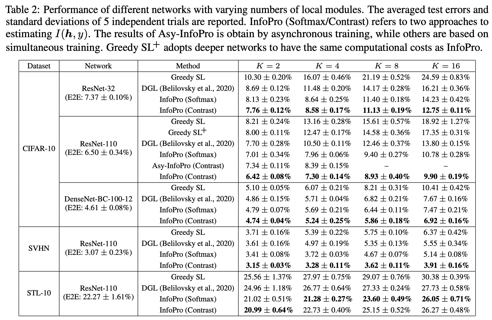
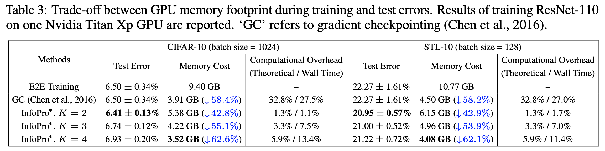

# Image Classification on CIFAR/SVHN/STL10

## Requirements
- python 3.7.7
- pytorch 1.6.0
- torchvision 0.8.1


## Run

- Please see [comand.sh](https://github.com/blackfeather-wang/InfoPro-Pytorch/blob/main/Experiments%20on%20CIFAR-SVHN-STL10/comand.sh) for all the commands.

Train ResNet-110 + InfoPro on CIFAR-10

```
CUDA_VISIBLE_DEVICES=0 python train.py --dataset cifar10 --model resnet --layers 110 --droprate 0.0 --cos_lr --local_module_num 2  --local_loss_mode contrast --aux_net_widen 1 --aux_net_feature_dim 128 --ixx_1 5 --ixy_1 0.5 --ixx_2 0   --ixy_2 0 --aux_net_config 1c2f
CUDA_VISIBLE_DEVICES=0 python train.py --dataset cifar10 --model resnet --layers 110 --droprate 0.0 --cos_lr --local_module_num 4  --local_loss_mode contrast --aux_net_widen 1 --aux_net_feature_dim 128 --ixx_1 1 --ixy_1 0   --ixx_2 0   --ixy_2 1 --aux_net_config 1c2f
CUDA_VISIBLE_DEVICES=0 python train.py --dataset cifar10 --model resnet --layers 110 --droprate 0.0 --cos_lr --local_module_num 8  --local_loss_mode contrast --aux_net_widen 1 --aux_net_feature_dim 128 --ixx_1 5 --ixy_1 0   --ixx_2 0   --ixy_2 1 --aux_net_config 1c2f
CUDA_VISIBLE_DEVICES=0 python train.py --dataset cifar10 --model resnet --layers 110 --droprate 0.0 --cos_lr --local_module_num 16 --local_loss_mode contrast --aux_net_widen 1 --aux_net_feature_dim 128 --ixx_1 5 --ixy_1 0   --ixx_2 0.5 --ixy_2 1 --aux_net_config 1c2f
```

Train ResNet-110 + InfoPro* on CIFAR-10

```
CUDA_VISIBLE_DEVICES=0 python train.py --dataset cifar10 --model resnet --layers 110 --droprate 0.0 --cos_lr --local_module_num 2  --local_loss_mode contrast --aux_net_widen 1 --aux_net_feature_dim 128 --ixx_1 5 --ixy_1 0.1 --ixx_2 0 --ixy_2 0   --aux_net_config 1c2f --balanced_memory
CUDA_VISIBLE_DEVICES=0 python train.py --dataset cifar10 --model resnet --layers 110 --droprate 0.0 --cos_lr --local_module_num 3  --local_loss_mode contrast --aux_net_widen 1 --aux_net_feature_dim 128 --ixx_1 5 --ixy_1 0   --ixx_2 5 --ixy_2 0.1 --aux_net_config 1c2f --balanced_memory
CUDA_VISIBLE_DEVICES=0 python train.py --dataset cifar10 --model resnet --layers 110 --droprate 0.0 --cos_lr --local_module_num 4  --local_loss_mode contrast --aux_net_widen 1 --aux_net_feature_dim 128 --ixx_1 5 --ixy_1 0   --ixx_2 5 --ixy_2 0.1 --aux_net_config 1c2f --balanced_memory
```


## Results

<p align="center">
    
</p>

<p align="center">
    
</p>

## References

This repo is based on the codes from [ISDA](https://github.com/blackfeather-wang/ISDA-for-Deep-Networks)
