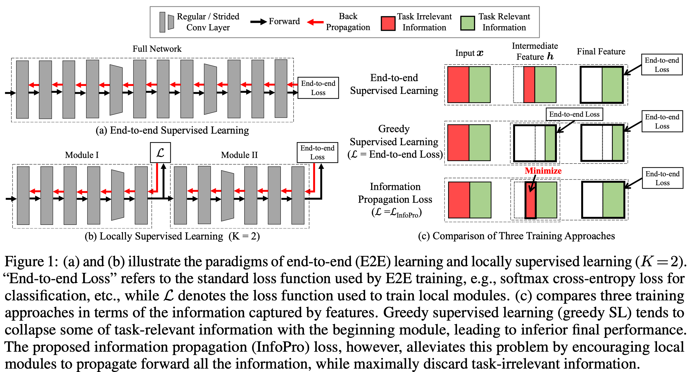
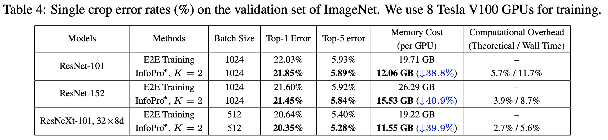
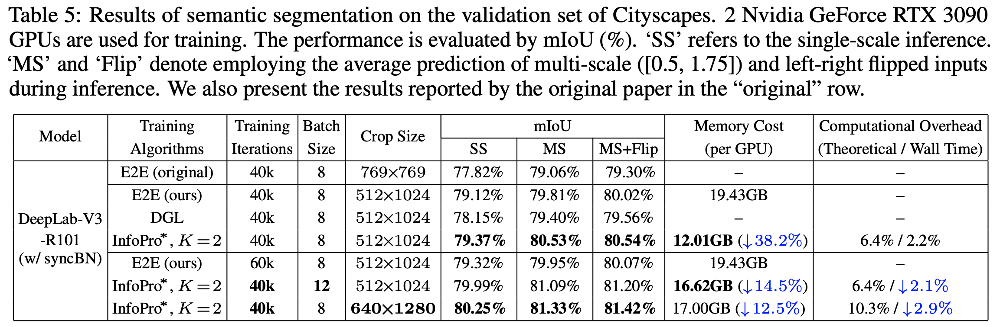

# InfoPro-Pytorch

The Information Propagation algorithm for training deep networks with local supervision.

- (ICLR 2021) [Revisiting Locally Supervised Learning: an Alternative to End-to-end Training](https://openreview.net/forum?id=fAbkE6ant2)


**Update on 2021/01/25: Release Pre-trained models on ImageNet and Cityscapes.**

**Update on 2021/01/24: Release Code for Image Classification on CIFAR/SVHN/STL10/ImageNet and Semantic Segmentation on Cityscapes.**


## Introduction

We propose Information Propagation (InfoPro), a locally supervised deep learning algorithm, from the information-theoretic perspective.
By splitting the whole deep network into multiple local modules and training them with local InfoPro loss,
we reduce the GPU memory footprint by 40-60% without introducing notable extra computational cost or training time,
but improve the performance moderately.

<p align="center">
    
</p>


## Citation

If you find this work valuable or use our code in your own research, please consider citing us with the following bibtex:

```
@inproceedings{wang2021revisiting,
        title = {Revisiting Locally Supervised Learning: an Alternative to End-to-end Training},
       author = {Yulin Wang and Zanlin Ni and Shiji Song and Le Yang and Gao Huang},
    booktitle = {International Conference on Learning Representations (ICLR)},
         year = {2021},
          url = {https://openreview.net/forum?id=fAbkE6ant2}
}
```

## Get Started

Please go to the folder [Experiments on CIFAR-SVHN-STL10](https://github.com/blackfeather-wang/InfoPro-Pytorch/tree/main/Experiments%20on%20CIFAR-SVHN-STL10), [Experiments on ImageNet](https://github.com/blackfeather-wang/InfoPro-Pytorch/tree/main/Experiments%20on%20ImageNet) and [Semantic segmentation](https://github.com/blackfeather-wang/InfoPro-Pytorch/tree/main/Semantic%20segmentation) for specific docs.


## Results

- CIFAR & STL-10
<p align="center">
    
</p>


- ImageNet
<p align="center">
    
</p>


- Semantic Segmentation
<p align="center">
    
</p>


## GPU Memory Cost

In the paper, we report the minimally required GPU memory to run the InfoPro* algorithm with torch.backends.cudnn.benchmark=True (for practical acceleration).
Note that this result is (sometimes largely) different from what is printed by nvidia-smi.


## Contact
This repo is a re-implementation of our original code. If you have any question, please feel free to contact the authors. Yulin Wang: wang-yl19@mails.tsinghua.edu.cn.


## Acknowledgments
Our code of Semantic Segmentation is from [MMSegmentation](https://github.com/open-mmlab/mmsegmentation). We highly appreciate their awesome work!